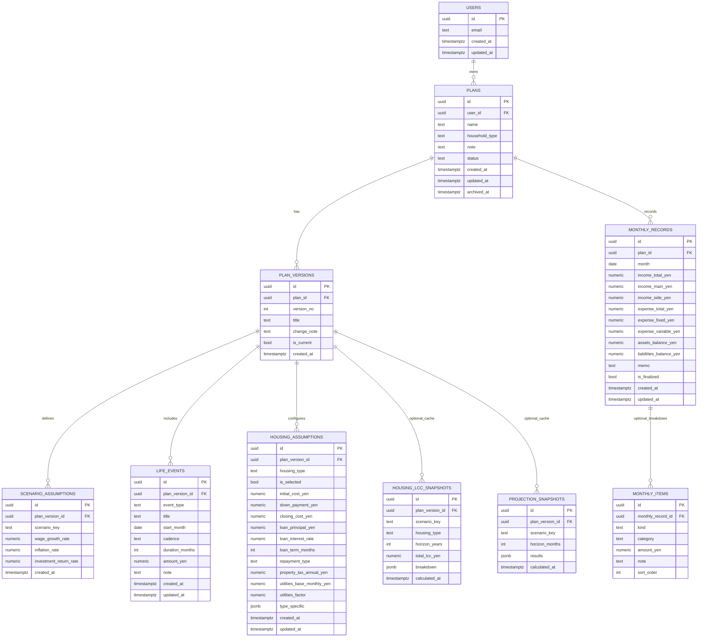

```mermaid
erDiagram
USERS ||--o{ PLANS : owns
PLANS ||--o{ PLAN_VERSIONS : has
PLANS ||--o{ MONTHLY_RECORDS : records

PLAN_VERSIONS ||--o{ SCENARIO_ASSUMPTIONS : defines
PLAN_VERSIONS ||--o{ LIFE_EVENTS : includes
PLAN_VERSIONS ||--o{ HOUSING_ASSUMPTIONS : configures

MONTHLY_RECORDS ||--o{ MONTHLY_ITEMS : optional_breakdown

PLAN_VERSIONS ||--o{ HOUSING_LCC_SNAPSHOTS : optional_cache
PLAN_VERSIONS ||--o{ PROJECTION_SNAPSHOTS : optional_cache

USERS {
uuid id PK
text email
timestamptz created_at
timestamptz updated_at
}

PLANS {
uuid id PK
uuid user_id FK
text name
text household_type
text note
text status
timestamptz created_at
timestamptz updated_at
timestamptz archived_at
}

PLAN_VERSIONS {
uuid id PK
uuid plan_id FK
int version_no
text title
text change_note
bool is_current
timestamptz created_at
}

SCENARIO_ASSUMPTIONS {
uuid id PK
uuid plan_version_id FK
text scenario_key
numeric wage_growth_rate
numeric inflation_rate
numeric investment_return_rate
timestamptz created_at
}

LIFE_EVENTS {
uuid id PK
uuid plan_version_id FK
text event_type
text title
date start_month
text cadence
int duration_months
numeric amount_yen
text note
timestamptz created_at
timestamptz updated_at
}

HOUSING_ASSUMPTIONS {
uuid id PK
uuid plan_version_id FK
text housing_type
bool is_selected
numeric initial_cost_yen
numeric down_payment_yen
numeric closing_cost_yen
numeric loan_principal_yen
numeric loan_interest_rate
int loan_term_months
text repayment_type
numeric property_tax_annual_yen
numeric utilities_base_monthly_yen
numeric utilities_factor
jsonb type_specific
timestamptz created_at
timestamptz updated_at
}

MONTHLY_RECORDS {
uuid id PK
uuid plan_id FK
date month
numeric income_total_yen
numeric income_main_yen
numeric income_side_yen
numeric expense_total_yen
numeric expense_fixed_yen
numeric expense_variable_yen
numeric assets_balance_yen
numeric liabilities_balance_yen
text memo
bool is_finalized
timestamptz created_at
timestamptz updated_at
}

MONTHLY_ITEMS {
uuid id PK
uuid monthly_record_id FK
text kind
text category
numeric amount_yen
text note
int sort_order
}

HOUSING_LCC_SNAPSHOTS {
uuid id PK
uuid plan_version_id FK
text scenario_key
text housing_type
int horizon_years
numeric total_lcc_yen
jsonb breakdown
timestamptz calculated_at
}

PROJECTION_SNAPSHOTS {
uuid id PK
uuid plan_version_id FK
text scenario_key
int horizon_months
jsonb results
timestamptz calculated_at
}
```
